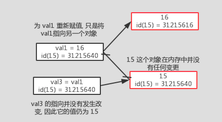
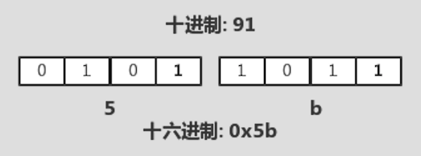
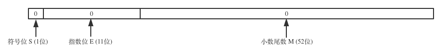
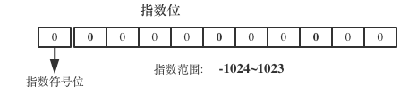

<!SLIDE center subsection>

# 数字类型
在 Python 中, 数字类型可划分为两类:

- 整数类型
  - 布尔类型
- 浮点数

<!SLIDE transition=turnUp>

# 整数类型

在Python中, 整型大小的限制取决于宿主计算机的内存大小. 当数值过大时, Python 会自动分配一块内存来存放该值, 因此在Python中, 很少能出现整数溢出的情况.

    @@@ Python execute
    print(100 ** 100)

# 定义整数变量

<ul><li>
使用数字字面量定义整数类型变量
</li></ul>
    @@@ python
    int1 = 95

<ul><li>
使用内置函数 int()
</li></ul>
    @@@ python
    int2 = int(95)

<!SLIDE transition=turnUp>

# 整数运算

| 语法 | 描述  | 简写 | 
| --           | -- | :--: |
| x + y        | 加 | +=
| x - y        | 减 | -=
| x * y        | 乘 | *=
| x / y        | 除(*) |  /=
| x // y       | 地板除 | //=
| x % y        | 模运算 | %=
| x \*\* y     | 幂运算 | \*\*=
| -x           | 负数 |
| +x           | 正数 |
| abs(x)       | 绝对值 |
| divmod(x, y) | 返回一个元组, 包含 x/y 的商和余数 |
| pow(x, y)    | x 的 y 次幂 |

<!SLIDE transition=turnUp>

# 整数运算示例

小数除

    @@@ Python execute
    print(5 / 3)

Python2

    @@@ Python execute
    print(5.0 / 3)

Python2 引用 division 模块

    @@@ Python execute
    from __future__ import division
    print(5.0 / 3)

地板除

    @@@ Python execute
    print(5 // 3)

绝对值

    @@@ Python execute
    print(abs(-8))

取整(舍掉小数位)

    @@@ Python execute
    print(int(3.7))
<!SLIDE transition=turnUp>

# Python2 中的 long 整型

在 Python2 中, 除了 `int` 类型之外, 还存在 `long` 类型, 在整数值后面追加 `L` 或 `l`(推荐使用大写L, 显示直观), 即可定义一个 `long int` 类型的变量

    @@@ python
    int_l = 2L
    type(int_l)

使用内置函数 `long()` 创建长整型变量

    @@@ python
    int_l = long()

如果一个 `int` 类型的值大小超出最大限制, 将会被自动转换成 `long` 类型

    @@@ python
    import sys
    type(sys.maxsize)
    type(sys.maxsize + 1)

.callout.info 在 Python3 中, 摒弃了 `long` 类型, 因此在 Python3 中后缀 `L` 将会导致语法错误, 并且内置函数 `long()` 也已经不复存在了. 取而代之, 全部使用 `int` 类型.

<!SLIDE transition=turnUp>

# 整数类型的本质

在 Python 中, **一切皆对象**, 包括一个整数或一个整数变量

    @@@ Python execute
    print(dir(5))

在 Python 中, 数值类型的值为 **只读** 的. 可以通过内置函数 `id()` 可以获取到 Python 对象的唯一ID.

<!SLIDE transition=turnUp>

# 整型的进制与位运算

Python 同样支持数字的不同进制表示形式:
  - 十进制 `18`, 对应的转换函数 `int(N)`

  - 二进制 `0b10010`, 对应的转换函数 `bin(N)`

  - 八进制 `022`, 对应的转换函数 `oct(N)`

  - 十六进制 `0x12`, 对应的转换函数 `hex(N)`

<!SLIDE transition=turnUp>

# 位运算

位运算符

| 语法 | 描述 | 简写 |
| --     | -- | :--: |
| i &#124; j| 或: 只要一个为1, 结果即为1 | \|= |
| `i ^ j`  | 异或: 相同为0, 不同为1 | ^=
| `i & j`  | 并且: 全部为1, 值为1, 否则为0| &=|
| `i << j` | 向左移位: | <<= 
| `i >> j` | 向右移位: | >>=
| `~i`     | 取反: 1->0, 0->1 |

<!SLIDE transition=turnUp>

# 位运算使用场景

用途最多就是作为标志位, 如 Linux 权限位.

- `1`: 执行权限
- `2`: 写权限
- `4`: 读权限

## 位运算示例

打开/关闭 Linux 权限位

      0 1 0 0              0 1 1 0 
    | 0 0 1 0  = 4 | 2   & 1 1 0 1  = 4 & ~2
    ----------           ----------
      0 1 1 0              0 1 0 0

<!SLIDE center subsection>

# bool型

布尔类型属于整数类型的一种, 只存在两个值:

- `True`: 一切非0值和非空值, 转换成整数是为 `1`

- `False`: 0 和 空值, 转换成整数时为 `0`

可以像其它数据类型一样, 调用内置函数 `bool()` 返回一个布尔对象.

    @@@ python
    bool()       # False
    bool(0)      # False
    bool('')     # False
    bool(-4)     # True
    bool('str')  # True

bool 的特殊作用

    @@@ python
    ['val1', 'val2'][True]   # 'val2'
    ['val1', 'val2'][False]  # 'val1'
    ['val1', 'val2'][1 > 2]  # 'val1'

<!SLIDE center subsection>

# 比较关系运算符

运算符 | 描述 | 示例 |
---   | --- | ---
`==` | 如果两个操作数的值相等，则条件为真.                | (a == b)求值结果为 false
`!=` | 如果两个操作数的值不相等，则条件为真.               | (a != b)求值结果为 true
`>`  | 如果左操作数的值大于右操作数的值，则条件成为真.      | (a > b)求值结果为 false
`<`  | 如果左操作数的值小于右操作数的值，则条件成为真.      | (a < b)求值结果为 true
`>=` | 如果左操作数的值大于或等于右操作数的值，则条件成为真. | (a >= b)求值结果为 false
`<=` | 如果左操作数的值小于或等于右操作数的值，则条件成为真. | (a <= b)求值结果为 true

<!SLIDE center subsection>

# 浮点数

在Python中, 浮点数用64位来表示的, 与 C 语言中的 double(双精度) 类型一样.

    @@@ python
    f1 = 1.234

使用 `float()` 内置函数创建浮点数

    @@@ python
    f2 = float(1.234)

    @@@ python
    int(3.81)    # 3 直接舍掉小数部分
    round(3.81)  # 四舍五入

查看浮点数 `float` 帮助信息

    @@@ python execute
    help(float)

<!SLIDE transition=turnUp>

# 浮点数的本质

十进制小数

<code>
123.456 = 1*102 + 2*101 + 3*100 + 4*10-1 + 5*10-2 + 6*10-3 = 1.23456*102

</code>

二进制小数

<code>
1.01101 = 1*20 + 0*2-1 + 1*2-2 + 1*2-3 + 0*2-4 + 1*2-5 = 0.25 + 0.125 + 0.03125 = 0.40625

</code>

浮点数内存结构图(定点数)

---

指数位示意图

指数(e)转换规则: `指数 + 基数` 
其中基数(bias)为: <code>2k-1 - 1</code> 
`k` 为指数位的字节长度, 对于32位浮点数是 8 个字节, 对于 64 为浮点数来说, 是 11 位, 这是由 `IEEE` 标准规定的.

浮点数转换规则:
<code>
V = (-1)s × M × 2E
</code>, 
<code>
E = e - bias
</code>

<!SLIDE transition=turnUp>
# match 库

| 语法 | 描述
| -- | --
| math.sin(x)   | x 的正弦值
| math.cos(x)   | x 的余弦值
| math.tan(x)   | x 的正切值
| math.sin(x)   | x 的余切值
| math.pi       | 圆周率 PI
| math.fabs(x)  | 绝对值
| math.floor(x) | 小于 x 的最大整数
| math.ceil(x)  | 大于 x 的最小整数

    @@@ python
    import math
    math.floor(3.81) # 小于3.81的最大整数
    3
    math.ceil(3.81)  # 大于3.81的最小整数
    4