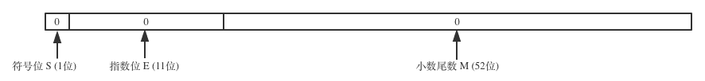
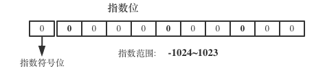

<!SLIDE center subsection>

# 浮点数

在Python中, 浮点数用64位来表示的, 与 C 语言中的 double(双精度) 类型一样.

    @@@ python
    f1 = 1.234

使用 `float()` 内置函数创建浮点数

    @@@ python
    f2 = float(1.234)

    # 使用 int() 函数将一个浮点型数值转换成整型
    int(3.81)    # 3 直接舍掉小数部分
    round(3.81)  # 四舍五入

<!SLIDE transition=turnUp>

# 浮点数的本质

整型在计算机中的存储

浮点数内存结构图(定点数)

十进制小数

<code>
123.456 = 1*102 + 2*101 + 3*100 + 4*10-1 + 5*10-2 + 6*10-3 = 1.23456*102

</code>

二进制小数

<code>
1.01101 = 1*20 + 0*2-1 + 1*2-2 + 1*2-3 + 0*2-4 + 1*2-5 = 0.25 + 0.125 + 0.03125 = 0.40625

</code>

---

指数位示意图

指数(e)转换规则: `指数 + 基数` 
其中基数(bias)为: <code>2k-1 - 1</code> 
`k` 为指数位的字节长度, 对于32位浮点数是 8 个字节, 对于 64 为浮点数来说, 是 11 位, 这是由 `IEEE` 标准规定的.

浮点数转换规则:
<code>
V = (-1)s × M × 2E
</code>, 
<code>
E = e - bias
</code>

<!SLIDE>
# match 库

| 语法 | 描述
| -- | --
| math.sin(x)   | x 的正弦值
| math.cos(x)   | x 的余弦值
| math.tan(x)   | x 的正切值
| math.sin(x)   | x 的余切值
| math.pi       | 圆周率 PI
| math.fabs(x)  | 绝对值
| math.floor(x) | 小于 x 的最大整数
| math.ceil(x)  | 大于 x 的最小整数

    @@@ python
    import math
    math.floor(3.81) # 小于3.81的最大整数
    3
    math.ceil(3.81)  # 大于3.81的最小整数
    4