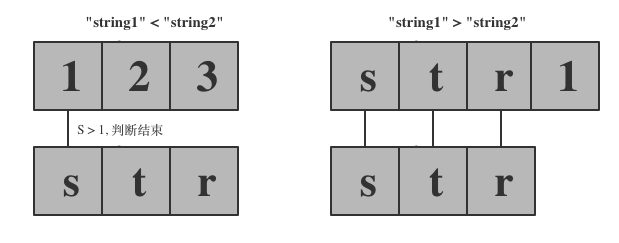
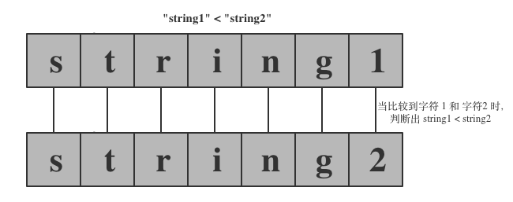
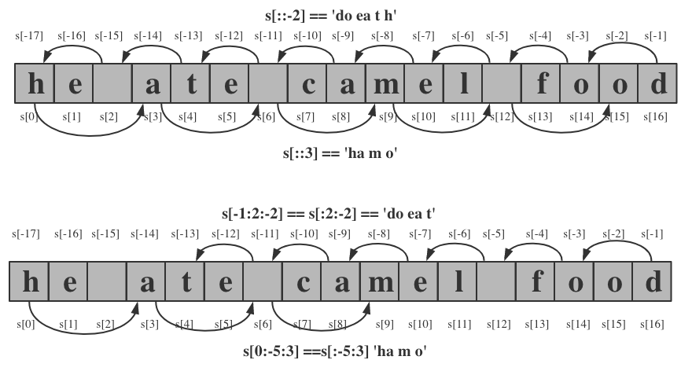

<!SLIDE center subsection>
# 字符串类型

和数字类型一样, 字符串同样是不可变对象. 为一个变量重新赋值一个新字符串值时, 实际上是创建了一个新的字符串对象, 并将该变量指向这个新创建的字符串对象.

创建字符串内置函数 `str()`

<!SLIDE transition=turnUp>
# 创建字符串对象

使用字符串字面量值

    @@@ python execute
    s1 = 'string1'
    print(s1)

`str()` 内置函数

    @@@ python execute
    print(str('string'))

多行字符串

    @@@ python execute
    s2 = 'this \
    is \
    one \
    line'
    print(s2)

三引号(triple quoted string)

    @@@ python execute
    s3 = """This is a multiple lines string.
    line2
        line3
    """
    print(s3)

括号中的字符串

    @@@ python execute
    s4 = ("This is the nice way to join two long string "
    "togeter; it relies on string literal concatenation.")
    print(s4)

.callout.info 在 Python 中, 单引号与双引号意义完全相同, 因此上面的示例都可以使用双引号来代替

# 字符串相加

我们可以使用 `+` 将多个字符串拼接到一起, 形成一个新的字符串.

    @@@ python execute
    a = 's'
    b = 'tr'
    c = 'ing'
    print(a + b + c)

.callout.warning 字符串对象与数字对象一样, 属于不可变类型, 当使用 `+` 拼接多个字符串时, 每遇到一个 `+` 都将生成一个新的字符串对象, 效率低下.

<!SLIDE transition=turnUp>
# Python2 与 Python3 中的字符串

分别在 Python2 和 Python3 中执行以下代码片段

    @@@ python
    #!/usr/bin/env python

    print("你好, 拍森")

[utf-8 编码查询](http://www.ltg.ed.ac.uk/~richard/utf-8.cgi)

.callout.info Python2 默认使用 ASCII 编码, 而 Python3 中使用 UNICODE 作为默认的编码值.

解决办法:

- `# -*- coding: utf-8 -*-`
- `# encoding: utf-8`

<!SLIDE transition=turnUp>
# 转义字符

| 转义字符   | 说明
| --         |  -- |
| `\newline` | 转义换行
| `\\`       | 转义 \
| `\'`       | 转义 '
| `\"`       | 转义 "
| `\a`       | ASCII 铃音字符
| `\b`       | 回退字符
| `\f`       | 换页* 
| `\v`       | 垂直制表(VT)
| `\r`       | 回车(CR) ，将当前位置移到本行开头(输入的字符会覆盖当前字符)
| `\n`       | 换行(LF) ，将当前位置移到下一行开头
| `\uhhhh`   | 16位的十六进制值 |
| `\Uhhhhhhhh`| 32位的十六进制值 |

引号转义

    @@@ python
    a = "Single 'quotes' are fine; \"doubles\" must be escaped."
    b = 'Single \'quotes\' must be escaped; "doubles" are fine.'
    c = '''both single 'quotes' and double "quotes" are fine.'''

<!SLIDE transition=turnUp>

# 原始字符串(raw)

有时候一个字符串中包含了大量需要转义的字符(正则表达式), 可以通过在字符串前加上 `r` 字符, 来表示这是一个原始字符串, 不要做任何转义.

    @@@ python execute
    print(r"123456\rab")

<!SLIDE transition=turnUp>

# 字符串比较

字符串支持像整数类型那样的比较运算符操作, `<`, `<=`, `==`, `!=`, `>`, 和 `>=`.

对比两个字符串时, 字符串将被拆分成一个一个的字符, 字符会被转正对应的数字, 然后对两个字符串中的每个字符进行对比.

<!SLIDE transition=turnUp>

# 字符串索引

在 Python 中, 我们可以通过下标索引的方式访问字符串中的某个或某一段子字符串(称之为: 切片), 格式为: `s[N]`, 其中 `N` 为字符索引位置, 其取值范围 `0 <= N < len(s)` 或 `-1 <= N <= -(len(s))`.

    @@@ python execute
    s = 'Light ray'
    print(s[0])
    print(s[-2])

.callout.info 如果索引超出字符串范围, 将抛出 `IndexError` 异常.

<!SLIDE transition=turnUp>

# 字符切片

切片: 从字符串中提取子字符串片段, 格式为:

`seq[start:stop:step]`, 其中:

  - `start`: 表示字符串起始索引位置, 其值可为正, 也可为负, 忽略不写表示从 0 开始
  - `stop` 字符串终止索引位置, 其值可为正, 也可为负, 忽略不写表示到字符串结尾
  - `step` 步长, 默认为 1

最终截取到的字符串为: `start <= 片段 < stop`

.callout.info `seq` 可以是任何序列对象, 包括后面要讲到的 `tuple`, `list` 等等.

切片操作可以作用到字符串的任意一端:

  - `步长为正`: 从左至右, `start < stop`

  - `步长为负`: 从右至左, `start > stop`

<!SLIDE transition=turnUp>

# 字符切片示例

步长为正

    @@@ python
    s = 'he ate camel food'
    s[0:2]
    s[:2]
    s[3:6]
    s[13:]
    s[7:-5]
    s[0:-5:3]
    s[::]
    s[::3]

步长为负

    @@@ python
    s[5:2:-1]
    s[::-1]
    s[-1:2:-2]

<!SLIDE transition=turnUp>

# 字符串方法

字符串中包含了大量的方法, 熟悉这些方法将有助于我们操作字符串.

`dir(str)` 可以让我们获取到字符串对象中的所有属性和方法.  
`help(str)` 查看字符串类中各个函数的帮助文档.

| 方法 | 说明 |
| -- | -- |
| `s.capitalize()` | 返回一个 `s` 的拷贝字符串对象, 其首字母为大写 |
| `s.center(width[, char])` | 返回一个 `s` 的拷贝字符串, 原字符串居中, 并使用 `char` (默认空格)填充至长度 `width` |
| `s.zfill(w)` | 返回一个 `s` 的拷贝字符串对象, 如果字符串长度小于 `w`, 则在字符串前用 `0` 将其填充至长度 `w` |
| `s.ljust(width[, char])` | 返回一个 `s` 的拷贝字符串对象, 如果字符串长度小于 `width`, 则在字符串后面用字符 `char`(默认空格) 将其填充至长度 `width` |
| `s.rjust(width[, char])` |  返回一个 `s` 的拷贝字符串对象, 如果字符串长度小于 `width`, 则在字符串前面用字符 `char`(默认空格) 将其填充至长度 `width`  |
| `s.startswith(x[, start[, end]])` | 如果字符串 `s` 以 `x` 开始(或在 `start:end` 区间, 如果指定这2个参数), 则返回 `True` | 
| `s.endswith(x[, start[, end]])` | 如果字符串 `s` 以 `x` 结尾(或在 `start:end` 区间, 如果指定这2个参数), 则返回 `True` | 
| `s.find(t[, start[, end]])` | 按照从左至又的顺序在字符串 `s` 中搜索 `t`(或在 `start:end` 区间, 如果指定这2个参数), 返回找到的第一个字符串的索引位置, 或者返回 `-1` 如果没找到. |
| `s.rfind(t[, start[, end]])` | 与 `find` 类似, 只是从最字符串的最右侧开始查找 |
| `s.index(t[, start[, end]])` | 与 `find` 功能类似, 只是如果没有找到 `t`, 该函数将抛出 `ValueError` 异常 |
| `s.rindex(t[, start[, end]])` | 与 `rfind` 功能类似, 只是如果没找找到 `t` , 该函数将抛出 `ValueError` 异常 |
| `s.count(t[, start[, end]])` | 返回字符 `t` 在字符串 `s` 中出现的次数, 并且搜索范围在 `start:end` 之间, 如果指定了这2个参数. |
| `s.isalnum()` | 返回 `True` 如果字符串 `s` 不为空, 并且每个字符都是数字或字母, 否则返回 `False` |
| `s.isalpha()` | 返回 `True` 如果字符串 `s` 不为空, 并且每个字符都是字母, 否则返回 `False` |
| `s.isidentifier()` | 返回 `True` 如果字符串 `s` 不为空, 并且 `s` 可以做为一个合法的标识符, 否则返回 `False` |
| `s.isspace()` | 返回 `True` 如果字符串 `s` 是由空白字符组成, 否则返回 `False` |
| `s.isdecimal()` | 返回 `True` 如果字符串 `s` 不为空, 并且每个字符都是十进制的 unicode 数字字符, 否则返回 `False` |
| `s.isdigit()` | 返回 `True` 如果字符串 `s` 不为空, 并且每个字符都是 ASCILL 的数值, 否则返回 `False` |
| `s.isnumeric()` | 返回 `True` 如果字符串 `s` 不为空, 并且每个字符都是 Unicode 编码的数值, 否则返回 `False` |
| `s.islower()` | 返回 `True` 如果字符串 `s` 中至少包含一个有大小写规则字符, 并且所有有大小写规则的字符全部为小写, 否则返回 `False` |
| `s.isupper()` | 返回 `True` 如果字符串 `s` 中至少包含一个有大小写规则字符, 并且所有有大小写规则的字符全部为大写, 否则返回 `False` |
| `s.lower()` | 返回字符串的小写形式 |
| `s.upper()` | 返回字符串的小写形式 |
| `s.swapcase()` | 将字符串中的小写字母转换成大写, 大写字母转换成小写 | 
| `s.format(...)` | 格式化 |
| `s.join(seq)` | 将序列 `seq` 里的所有元素都拼接到一起, 并在每个字符串的拼接处添加 `s` |
| `s.replace(t, u[, n])` | 将字符串中出现的所有字符 `t` 替换成字符 `u`, 最多替换 `n` 次, 如果指定了 `n` 参数, 否则全部替换 | 
| `s.split(t[, n])` | 将字符串按照字符 `t` 作为分割点切分字符串, 返回一个列表, 最多切割 `n` 次, 如果指定了 `n` 参数 |
| `s.rsplit(t[, n])` | 与 `split()` 类似, 但是从右侧开始切割 |
| `s.splitlines(f)` | 以换行符为切割点切割字符串 |
| `s.lstrip(chars)` | 将字符串左边的空格去掉并返回 |
| `s.rstrip(chars)` | 将字符串右边的空格去掉并返回 |
| `s.strip(chars)` | 将字符串两边的空格去掉并返回 |

.callout.info 由于字符串是非可变类型, 以上所有涉及修改字符串的函数都将返回一个新的字符串对象.

<!SLIDE transition=turnUp>
# 字符串方法示例

    @@@ python
    ' '.join(('s1', 's2', 's3'))
    # 's1 s2 s3'

    record = "Leo Tolstory*182808028*1910-11-20"
    record.find('Tolstory')
    # 4
    record.find('Tolstory', 0, 10)
    # -1
    record.find('Tolstory', 0, 15)
    # 4
    record.find('Tolstory', 0, -1)
    # 4

    record.replace('Leo', 'Zzl')
    # 'Zzl Tolstory*182808028*1910-11-20'

    fields = record.split("*")
    fields
    # ['Leo Tolstory', '1828-8-28', '1910-11-20']

    born = fields[1].split("-")
    born
    # ['1828', '8', '28']

<!SLIDE transition=turnUp>

# `format()` 方法

format() 方法将字符串中出现的 `{}` 替换成递给他的参数, 以此来返回一个新的字符串对象.

基本用法

    @@@ python
    '{} {}'.format('one', 'two')
    # 'one two'
    '{} {}'.format(1, 2)
    # '1 2'

    # 数字
    '{:d}'.format(42)
    # '42'

    # 字符串
    '{:s} {:d}'.format('one', 2)
    # one 2

    # 浮点数
    '{:f}'.format(3.141592653589793)
    # '3.141593'

    # 使用 {{ 输出 一个 {, }} 输出一个 }
    "{{{0}}} {1} ;-}}".format("I'm in braces", "I'm not")
    # "{I'm in braces} I'm not ;-}"

    # 带符号数字
    '{:+d}'.format(42)
    # '+42'
    '{:+d}'.format(42)
    # '-42'

位置参数

    @@@ python
    '{0} {1} {0}'.format('one', 'two')
    # 'one two one'

    # 同时指定类型
    '{0:s} {1:s} {0:s} {2:d}'.format('one', 'two', 3)
    # 'one two one 3'

字段名

    @@@ python
    '{who} turned {age} this year'.format(who='She', age=88)
    # 'She turned 88 this year'

    'The {who} was {0} last week'.format(12, who='boy')
    # 'The boy was 12 last week'

    # 使用索引
    data = [4, 8, 15, 16, 23, 42]
    '{d[4]} {d[5]}'.format(d=data)
    # '23 42'

    # 使用键值
    person = {'first': 'Jean-Luc', 'last': 'Picard'}
    '{p[first]} {p[last]}'.format(p=person)
    # 'Jean-Luc Picard'

    # 名称占位符
    data = {'first': 'Hodor', 'last': 'Hodor!'}
    '{first} {last}'.format(**data)
    # 'Hodor Hodor!'
    '{first} {last}'.format(first='Hodor', last='Hodor!')
    # 'Hodor Hodor!'

    # 使用对象的属性
    import math
    'math.pi = {0.pi}'.format(math)

    element = 'Silver'
    number = 47
    "Element {number} is {element}".format(**locals())
    'Element 47 is Silver'

填充

    @@@ python
    # 左填充
    '{:>10}'.format('test')
    # '      test'

    # 右填充
    '{:10}'.format('test')
    '{:<10}'.format('test')
    # 'test      '

    # 指定填充字符
    '{:_>10}'.format('test')
    '______test'
    '{:*<10}'.format('test')
    # 'test******'

    # 居中
    '{:^10}'.format('test')
    # '   test   '

    # 对于填充字符不能正好平均分布到字符串两边的情况, 多出的那个字符将填充在右边
    '{:^6}'.format('zip')
    # ' zip  '

    # 填充数字
    '{:4d}'.format(42)
    # '  42'

    '{:04d}'.format(42)
    # '0042'

    # 指定填充字符串
    '{:*>10d}'.format(3)
    # '*********3'

截取

    @@@ python
    '{:.5}'.format('xylophone')
    # 'xylop'

    # 截取+填充
    '{:10.5}'.format('xylophone')
    # 'xylop     '

    # 使用四舍五入的方式截取小数位数
    '{:.9f}'.format(3.141592653589793)
    '3.141592654'

    '{:06.2f}'.format(3.141592653589793)
    # '003.14'

日期时间

    @@@ python
    from datetime import datetime
    '{:%Y-%m-%d %H:%M}'.format(datetime(2001, 2, 3, 4, 5))
    # '2001-02-03 04:05'

参数形式格式化

    @@@ python
    '{:{align}{width}}'.format('test', align='^', width='10')
    # '   test   '
    '{:.{prec}} = {:.{prec}f}'.format('Gibberish', 2.7182, prec=3)
    # 'Gib = 2.718'

    '{:.{prec}} = {:.{prec}f}'.format('Gibberish', 2.7182, prec=3)
    'Gib = 2.718'

    '{:{width}.{prec}f}'.format(2.7182, width=5, prec=2)
    # ' 2.72'
    
    '{:{prec}} = {:{prec}}'.format('Gibberish', 2.7182, prec='.3')
    # 'Gib = 2.72'

