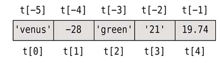

<!SLIDE center incremental subsection>
# 序列

序列类型是指包含了0个或多个元素的组合, 所有的序列类型都支持以下的功能:

- 支持使用成员关系操作符 `in` 判断是否某个特定成员存在于序列中.

- 支持使用 Python 的内置函数 `len()` 获取序列的长度

- 支持使用元素下标索引的方式访问序列中的某一个元素, 如果索引超出序列范围, 则抛出 `IndexError` 异常

- 支持切片操作

- 支持使用 `+` 拼接多个序列, `*` 重复一个序列

Python一共提供了五种内置的序列类型: `str`, `tuple`, `list`, `bytes` 以及 `bytearray`.

<!SLIDE>
# 元组(tuple)

元组是一个包含0个或多个元素的 **有序** 的不可变组合, 各个元素之间使用逗号( `,`) 分隔, 其中元组中的元素类型可以是任意的组合. 元组使用 `圆括号()` 来表示.

.callout.warning 元组是一种不可变序列类型, 一旦定义好一个元组后, 任何对其元素进行增加, 修改 或 删除的操作, 都将抛出 `TypeError` 异常.

示例

    @@@ python
    (1, 2, 3)
    ('one', 'two', 'three')
    (1, 'two', (3, 4))

<!SLIDE transition=turnUp>
# 创建元组

## 使用内建函数 `tuple()`
可以使用 `tuple()` 关键字创建一个元组对象. 如果不指定参数, 则创建一个包含 0 个元素的元组.

    @@@ python execute
    t = tuple()
    print(t)

`tuple()` 也支持传递一个可迭代的对象作为参数.(所有序列类型都是可迭代对象)

    @@@ python execute
    t = tuple('abc')
    print(t)

## 直接创建元组对象
使用 `()` 直接创建一个元组对象.

    @@@ python execute
    # 在定义元组时, 这里的括号可以忽略不写, 但为了便于阅读, 推荐使用括号.
    t = ('venus', -28, 'green', '21', -28, 19.75)
    print(t)

因为元组中的元素是任意的, 所以元组中可以包含其他的元组

    @@@ python execute
    t1 = ('venus', -28, 'green', '21', -28, 19.75)
    t2 = (1, t1)
    print(t2)

当我们使用括号来创建包含多个元素的元组时, 最后一个元素后面的逗号 `,` 可以忽略不写  
但是当元组中只有一个元素时, 元素后面的逗号 `,` 则不可以忽略

不使用 `,` 结尾

    @@@ python execute
    t = ('a')
    print(t)

使用 `,` 结尾

    @@@ python execute
    t = ('a',)  # 结尾逗号不能少
    print(t)

<!SLIDE transition=turnUp>
# 访问元组中的元素及切片

与 `str` 对象一样, 使用 `[下标索引]` 的方式来访问元组中的元素

    @@@ python
    t = (1, 2, ('venus', -28, 'green', '21', -28, 19.75), 'STG', 'SWG')
    t[1]
    t[-2]
    t[2][2]

.callout.info 如果索引超出范围, 则抛出 `ValueError` 异常.

# 元组切片

元组中的切片操作与字符串中的切片操作完全一致

    @@@ python
    t = ('venus', -28, 'green', '21', -28, 19.75)
    t[2:]
    t[:2]
    t[::]
    t[::-1]

输出结果

    @@@ Console
    ('green', '21', -28, 19.75)
    ('venus', -28)
    ('venus', -28, 'green', 21, -28, 19.75)
    (19.75, -28, '21', 'green', -28, 'venus')

<!SLIDE transition=turnUp>
# 元组中的函数

tuple 只有2个函数:

  - `t.count(x)` 返回对象 `x` 在元组中出现的次数
  - `t.index(x)` 返回对象 `x` 在元组中第一次出现的下标索引.

## 元组的其他操作

使用 `len()` 获取元组的长度

    @@@ python
    len(t)

使用 `+` 来拼接多个元组来生成一个新的元组对象(只能是元组相加)

    @@@ python execute
    hair = "black", "brown", "blonde", "red"
    # 返回一个包含了 `yellow` 元素的新元组, 注意逗号
    print(hair + ('yellow',))

使用 `*` 来重复元组多次

    @@@ python execute
    t = (1, 2) * 3
    print(t)

使用 `in` 或 `not in` 检测某个元素是否存在元组中

    @@@ python execute
    hair = ("black", "brown", "blonde", "red")
    print('black' in hair)
    print('yellow' in hair)
    print('yellow' not in hair)

使用 for in 迭代序列对象

    @@@ python execute
    hair = ("black", "brown", "blonde", "red")
    for col in hair:
        print(col)

<!SLIDE transition=turnUp>
# 解压元组

将元组中的元素一次解压到变量中

    @@@ python execute
    first, last = ('Jims', 'Smith')
    print(first)
    print(last)

与 `for...in` 合用

    @@@ python execute
    for x, y in ((1,1), (2,4), (3,9)):
        print(x, y)

Python3中的新功能

    @@@ python
    tup_str = ('str1', 'str2', 'str3', 'str4')
    str1, str2, *str3 = tup_str
    str1, *str2, str3 = tup_str

<!SLIDE center subsection>
# 命名元组

命名元组与元组一样, 也是元组, 唯一不同的是: 我们可以通过为元组中的每个元素定义一个唯一的名字, 通过这些名字来访问元组中的元素.

<!SLIDE transition=turnUp>
# 定义命名元组

要使用一个命名元组, 必须要先引入 `collections` 库中的 `namedtuple()` 方法, 通过调用该方法创建一个新的命名元组对象(类).

`collections.namedtuple()` 方法接收两个参数:

  - 第一个参数 Sale 是我们想要创建的自定义命名元组类型的名字
  - 第二个参数是使用空格或逗号分隔的一个字符串, 代表了每个元素对应的名字

创建一个自定义的命名元组类对象

    @@@ python
    import collections
    Sale = collections.namedtuple("Sale", "productid customerid date quantity price")

一旦我们创建好了一个新的命名元组对象, 就可以通过实例化该类来创建一个新的实例. 实例中才是存放真正数据的地方.

    @@@ python
    s1 = Sale(432, 921, "2017-01-01", 3, 7.99)
    s2 = Sale(productid=432, customerid=921, date='2017-01-01', quantity=3, price=7.99)

<!SLIDE transition=turnUp>
# 访问命名元组中的属性

因为命名元组是一个类对象, 我们需要使用 `.` 来访问类中的属性.

    @@@ python
    s1.productid
    s2.date

`_fields` 命名元组中的特殊属性, 一个包含了所有自定义元素名字的元组.

    @@@ python
    print(s1._fields)

`_asdict()` 返回一个字典对象, 以键值对的形式返回对应的值

    @@@ python
    dir_val = s1._asdict()
    print(dir_val['customerid'])
