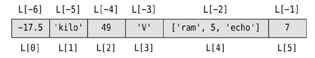
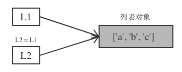

<!SLIDE>
# 列表(list)

列表是一个包含0个或多个元素的有序组合, 各个元素之间使用逗号`,` 分隔, 其中元组中的元素类型可以是任意的组合. 元组使用 `中括号[]` 来表示.

与元组不同, 列表中的元素是可以任意修改的.

    @@@ python
    [1, 2, 3]
    ['str1', 'str2', 'str3']
    [1, 'one', 'two', 3]
    [1, ['one', 'tow'], 3]
    ['one']

<!SLIDE transition=turnUp>
# 创建列表

使用内置函数 list()

    @@@ python
    L = list()
    L = list('abc')

使用 [] 直接创建一个列表对象.

    @@@ python
    L = [-17.5, "kilo", 49, "V", ["ram", 5, "echo"], 7]

<!SLIDE transition=turnUp>
# 列表常用操作

可以像元组那样通过下表索引访问元组中的元素

    @@@ python
    print(L[2])
    print(L[4][1])

列表切片

    @@@ python
    L[0] == L[-6] == -17.5
    L[1] == L[-5] == 'kilo'
    L[1][0] == L[-5][0] == 'k'
    L[4][2] == L[4][-1] == L[-2][2] == L[-2][-1] == 'echo'
    L[4][2][1] == L[4][2][-3] == L[-2][-1][1] == L[-2][-1][-3] == 'C'

使用 `len()` 获取列表的长度

    @@@ python execute
    L = [-17.5, "kilo", 49, "V", ["ram", 5, "echo"], 7]
    print(len(L))

使用 `+` 来拼接多个列表来生成一个新的列表对象

    @@@ python execute
    print(['a', 'b', 'c'] + ['d'])

使用 `*` 来重复列表多次

    @@@ python execute
    t = [1, 2] * 3
    print(t)

使用 `in` 或 `not in` 检测某个元素是否存在元组中

    @@@ python execute
    hair = ["black", "brown", "blonde", "red"]
    print('black' in hair)
    print('yellow' in hair)
    print('yellow' not in hair)

使用 for in 迭代序列对象

    @@@ python execute
    hair = ["black", "brown", "blonde", "red"]
    for col in hair:
        print(col)

<!SLIDE transition=turnUp>
# 修改列表元素

    @@@ python
    L = [-17.5, "kilo", 49, "V", ["ram", 5, "echo"], 7]

    L[1] = 15.4
    print(L)

    L[2:4] = [1, 2, 3, 4]
    print(L)

    L[2:4] = []
    print(L)

<!SLIDE transition=turnUp>
# 列表方法

Python 的列表提供了多个方法

| 语法 | 说明
| ---- | --- |
| `L.append(x)`    | 将元素 `x` 追加到列表尾部 |
| `L.extend(m)`    | 将可迭代对象 `m` 中的所有元素追加到列表的尾部, 与 `+=` 效果相同 |
| `L.index(x[, start[, end]])` | 从列表的左侧开始搜索元素 `X` 出现的第一次的索引位置, 如果没有找到, 则抛出 `ValueError` 异常 |
| `L.insert(i, x)` | 将对象 `x` 插入到索引 `i` 之前 |
| `L.pop()`        | 移除最右边的一个元素, 并返回移除的元素 |
| `L.pop(i)`       | 移除并返回下标所有为 `i` 的元素 |
| `L.remove(x)`    | 从列表的最左侧开始移除第一个 `x` 元素, 如果元素 `x` 不存在, 则抛出 `ValueError` 异常 |
| `L.clear()`       | 移除所有元素 |
| `L.acount(x)`    | 返回元素 `x` 在列表中出现的次数 |
| `L.copy()`       | |
| `L.reverse()`    | 反转列表中的所有元素(子列表并不会被翻转) |
| `L.sort()`       | |

<!SLIDE transition=turnUp>
# 列表变量的引用

L1 与 L2 引用同一个列表对象, 通过任何一个变量对这个列表对象作出的修改, 都会反映到另一个变量上.

`[:]`
使用切片形式, 将会创建一个新的一模一样的列表对象.

