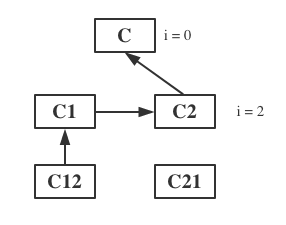

<!SLIDE transition=turnUp>
# 继承

当我们创建一个自定义时, 可以指定自定义类继承自一个或多个父类, 各个父类之间使用逗号 `,` 分隔.

在 Python 中, 类 `object` 是所有类的父类, 即所有类的最终父类就继承自 `object` 类.

    @@@ python
    class MyClass(ClassA, ClassB, ...)

子类实例默认拥有父类中的所有类属性和方法, 我们可以使用 `issubclass(childCls, parentCls)` 方法来判断 `childCls` 类是否属于 `parentCls` 类的子类.

我们可以使用 `super()` 方法在子类中调用父类的方法.

# 父类查找顺序

当一个类继承自多个父类时, Python中采用的是广度优先搜索.

