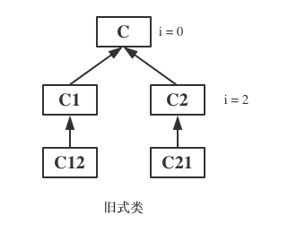

<!SLIDE transition=turnUp>
# Python2中的类

在 Python2 中, 有两种形式的类存在:

- 旧式类
- 新式类: Python2.2 版本中引入

为了代码的向后兼容, 当我们创建一个类时, 默认使用旧式类. 如果需要定义一个新式类, 我们的类要么是直接继承自 `object` 类, 要么是类的总根类继承自 `object` 类.  
或是通过在 python 文件中使用使用 `__metaclass__ = type`

示例:

    @@@ python
    class A(object): pass

    class B(A): pass

## 区别

- 只有在新式类中才有 `super()` 方法
- `type()` 返回结果不一样, 并且新式类中增加了 `__class__` 属性, 其值与 `type()` 一样
- 新式类中重新规划了父类搜索顺序, 采用了 C3 算法, 即广度优先搜索，而旧式类是采用深度优先搜索, 并在新式类中增加了 `__mro__` 属性, 可用来查看父类搜索顺序.
- 新式类 `__slots__`
- 新式类 `__getattribute__`

- 只有新式类才有描述器

.callout.info 在 Python3 中, 没有新式类和旧式类之分了, 所有的类全部属于新式类.

而在 Python3 中, 默认定义的所有类都是新式类.

新式类中才有 `super()`

    @@@ python
    class A(object):
        def __init__(self):
            print('A')

    class B(object):
        def __init__(self):
            print('B')

    class C(A, B):
        def __init__(self):
            print('C')
            super(C, self).__init__()

    c = C()
    # 输出: C A

